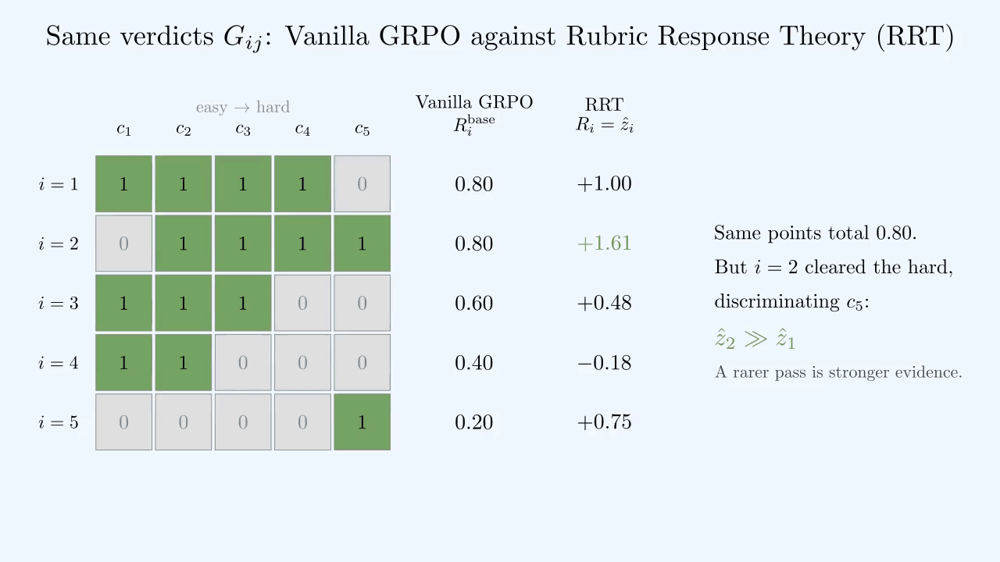
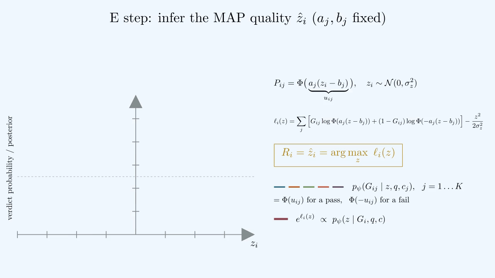
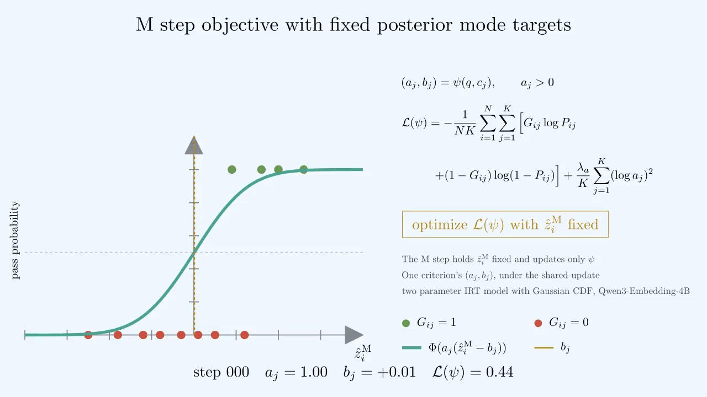
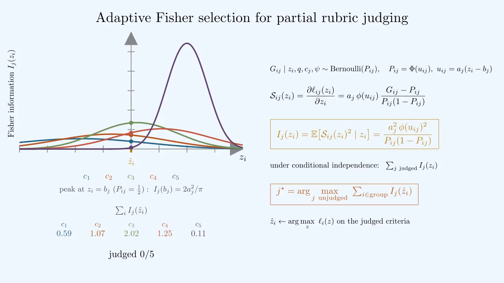

# Rubric Rewards from Item Response Theory

[](https://arxiv.org/abs/2609.35646) [](https://www.youtube.com/watch?v=EjtWicbvJr0)   

**Explore:** [🎬 RRT in action](#rrt-in-action) · [⚙️ Installation](#installation) · [🧪 Experiments](#experiments) · [🎯 Policy training](#policy-training) · [📊 Evaluation](#evaluation)

Reference implementation of **Rubric Response Theory (RRT)**. This repository provides dataset preparation, rollout judging, Response Parameter Network (RPN) fitting, rewards with frozen or online RPN updates, adaptive criterion selection, and held-out evaluation.

## Overview

Summing the points of satisfied criteria gives distinct verdict patterns the same reward and ignores how well each criterion separates the current rollouts. RRT instead fits a two-parameter item response model: the reward is the posterior mode of rollout quality given the verdicts, the RPN predicts each criterion's difficulty and discrimination from the prompt and criterion text, and online EM keeps the RPN calibrated as the policy changes. Adaptive Fisher selection judges only the most informative criteria to reduce judge requests.

> [!NOTE]
> Integrate [`RRTReward`](reward.py) into your existing GRPO or PPO training loop.

## RRT in action

Watch the video for a visual walkthrough of the method and results.

[](https://www.youtube.com/watch?v=EjtWicbvJr0)

RRT uses learned criterion difficulty and discrimination to turn each response's verdict pattern into a quality estimate. In this example, responses with the same rubric point total receive different rewards.



<details>
<summary>From verdicts to a reward: quality inference</summary>

The E step combines the criterion verdicts with a Gaussian quality prior and finds the maximum a posteriori (MAP) quality by bisection. This inferred quality is the reward.



</details>

## Installation

```bash
conda create --name rrt python=3.10 -y
conda activate rrt
python -m pip install -e ".[pipeline]"
export OPENAI_API_KEY="your-api-key"
```

Set `JUDGE_MODEL` if you want to override the default judge model. A CUDA GPU is recommended for rollout generation and RPN fitting.

## Experiments

The commands below use RubricHub Science as the example.

**Workflow:** 📚 Prepare data → 🧪 Judge rollouts → 🧠 Fit the RPN → 🎯 Train the policy → 📊 Evaluate

### Dataset preparation

Choose one converter:

```bash
# RubricHub Medical
python -m data_prep.convert_rubrichub --domain Medical

# RubricHub Science
python -m data_prep.convert_rubrichub --domain Science

# Rubrics as Rewards Science
python -m data_prep.convert_rar_science

# RubricBench
python -m data_prep.convert_rubricbench
```

Use `--out-dir /path/to/output` to change a converter's output directory.

### Rollout generation and judging

```bash
python build_rollout_cache.py \
  --data-dir data/datasets/rubrichub_science_irt \
  --output data/caches/science_base \
  --model /path/to/base-policy-checkpoint
```

This command uses the policy checkpoint's native chat template and calls the configured judge for each rubric criterion. Use `python build_rollout_cache.py --help` to change generation, judging, split, or device options.

### RPN fitting

The RPN predicts criterion difficulty and discrimination from the prompt and criterion text. In each M step, it fits the observed verdicts while holding the inferred quality targets fixed.



```bash
python fit_rpn.py \
  --cache data/caches/science_base \
  --output data/rpn/science
```

The fitted checkpoint is written to `data/rpn/science/rpn.pt`. Use `python fit_rpn.py --help` to select another embedding model or training configuration.

### Policy training

Collect all rollout records for a policy step, train the policy with their rewards, and then update and save the RPN:

```python
from reward import RRTReward

rrt = RRTReward("data/rpn/science/rpn.pt", online=True)

records = [
    rrt.score_from_verdicts(
        prompt,
        rubrics,
        presence,
    )
    for prompt, rubrics, presence in policy_step_rollouts
]

run_policy_update([record.reward for record in records])
rrt.update(records)
rrt.save("checkpoints/step_001/rpn.pt")
```

Each `rubrics` value is a list of dictionaries with `criterion` and `points` fields. Each `presence` value is the aligned Boolean verdict vector. Replace `policy_step_rollouts` and `run_policy_update` with the corresponding values and call from your trainer.

To let this package judge a response, pass a `RubricJudge` to `RRTReward` and call `score_response`.

#### Minimal GRPO with veRL

Install [veRL](https://verl.readthedocs.io/en/latest/start/install.html) with the rollout backend required by your hardware. The dataset converters above already write the `prompt`, `reward_model`, and `extra_info` fields expected by veRL.

```bash
git clone https://github.com/verl-project/verl.git /path/to/verl
python -m pip install -e "/path/to/verl[vllm]"
```

For the smallest integration, use a frozen RPN through veRL's custom reward function. Save this adapter as `verl_rrt_reward.py` in the repository root:

```python
from functools import lru_cache

from core.judge import RubricJudge
from reward import RRTReward


@lru_cache(maxsize=None)
def load_rrt(checkpoint, device):
    return RRTReward(
        checkpoint,
        device=device,
        online=False,
        judge=RubricJudge(),
    )


def compute_score(
    data_source,
    solution_str,
    ground_truth,
    extra_info=None,
    checkpoint="",
    device="cpu",
):
    info = extra_info or {}
    return load_rrt(checkpoint, device).score_response(
        info["user_prompt"],
        solution_str,
        info["rubrics_full"],
    ).reward
```

Start from [veRL's FSDP GRPO launcher](https://github.com/verl-project/verl/blob/main/examples/grpo_trainer/run_qwen3_8b_fsdp.sh) and add the RRT reward overrides:

```bash
RRT_ROOT=/absolute/path/to/rrt
VERL_ROOT=/absolute/path/to/verl

cd "$VERL_ROOT"
PYTHONPATH="$RRT_ROOT:${PYTHONPATH:-}" \
MODEL_PATH=/path/to/base-policy-checkpoint \
bash examples/grpo_trainer/run_qwen3_8b_fsdp.sh \
  data.train_files="$RRT_ROOT/data/datasets/rubrichub_science_irt/train.parquet" \
  data.val_files="$RRT_ROOT/data/datasets/rubrichub_science_irt/val.parquet" \
  reward.custom_reward_function.path="$RRT_ROOT/verl_rrt_reward.py" \
  reward.custom_reward_function.name=compute_score \
  reward.num_workers=1 \
  "+reward.custom_reward_function.reward_kwargs.checkpoint=$RRT_ROOT/data/rpn/science/rpn.pt" \
  "+reward.custom_reward_function.reward_kwargs.device=cpu" \
  "+ray_kwargs.ray_init.runtime_env.env_vars.PYTHONPATH=$RRT_ROOT" \
  'trainer.logger=["console"]'
```

This minimal veRL hook returns the RRT MAP quality from a frozen RPN. The pointwise reward hook has no policy-step callback, so online RPN updates require a custom veRL reward manager. Use the framework-independent loop above when implementing `rrt.update(records)` once per policy step.

#### Adaptive criterion selection

With a frozen RPN, adaptive selection judges the criterion with the largest total Fisher information across the response group, updates the quality estimates, and repeats until the criterion budget is reached. The animation illustrates selection on a rubric with five criteria.



```python
from core.judge import RubricJudge
from reward import RRTReward

rrt = RRTReward(
    "data/rpn/science/rpn.pt",
    online=False,
    judge=RubricJudge(),
)

records, selected = rrt.score_group_adaptive(
    prompt,
    responses,
    rubrics,
    budget=criterion_budget,
)
```

### Evaluation

First build a test cache for each policy:

```bash
python build_rollout_cache.py \
  --data-dir data/datasets/rubrichub_science_irt \
  --output data/caches/science_base_test \
  --model /path/to/base-policy-checkpoint \
  --splits test

python build_rollout_cache.py \
  --data-dir data/datasets/rubrichub_science_irt \
  --output data/caches/science_rrt_test \
  --model /path/to/rrt-policy-checkpoint \
  --splits test
```

Then compare the judged caches:

```bash
python evaluate.py \
  --data data/datasets/rubrichub_science_irt/test.parquet \
  --reference base \
  --output results/science.json \
  base=data/caches/science_base_test \
  rrt=data/caches/science_rrt_test
```

Use `python evaluate.py --help` for evaluation options.

## Citation

```bibtex
@article{yazdani2026rubric,
  title={Rubric Rewards from Item Response Theory},
  author={Yazdani, Milad and Souri, Yaser and Zhou, Xiren and Chawla, Pranit and Shahriari, Dena and Som, Subhojit and Song, Xia},
  journal={arXiv preprint arXiv:2609.35646},
  year={2026}
}
```
